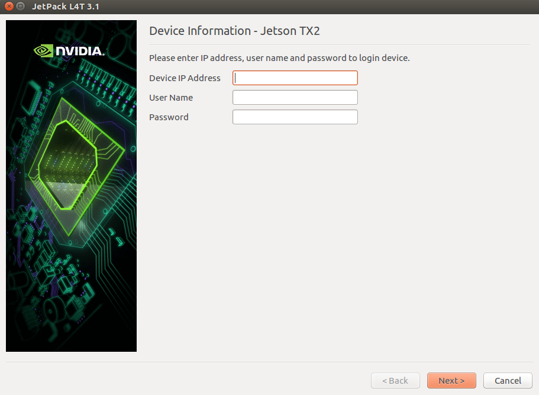

## Setup and Download files

1. Install Jetpack 3.1 and Download the system files.

```
./JetPack-L4T-3.1-linux-x64.run
```

<p align="center">
  
  
  
</p>

wait for downloading and extracting.

2. Install small TX2 configure with root:

```
sudo ./small-USB3/install.sh
```

## Flash the TX2.
1. Connect the TX2 and Carrier (or Dev-Kit) to the computer via USB
     Following the instructions in the appropriate manual.

2. Put the system to be flashed into recovery mode, following the 
       instructions in the appropriate manual.

4. Run flash script from Linux_for_Tegra directory.

```
cd 64_TX2/Linux_for_Tegra_tx2
sudo ./flashTX2.sh

```

5. Once the flashing has completed, the TX2 will reboot 

## Install CUDA.

1. Install Jetpack 3.1 and Download the files.

```
./JetPack-L4T-3.1-linux-x64.run
```

<p align="center">
  
  
  
</p>

wait for downloading and extracting.

2. connect your host computer and your TX2 on the same router. Find the IP address of your TX2:

sample: use arp-scan
```
sudo apt-get install arp-scan
```

use 
``` 
ifconfig
```

```
sudo arp-scan --interface=eth0 192.168.1.0/24 | grep NVIDIA
```

then 

<p align="center">
  
</p>

wait for install.


